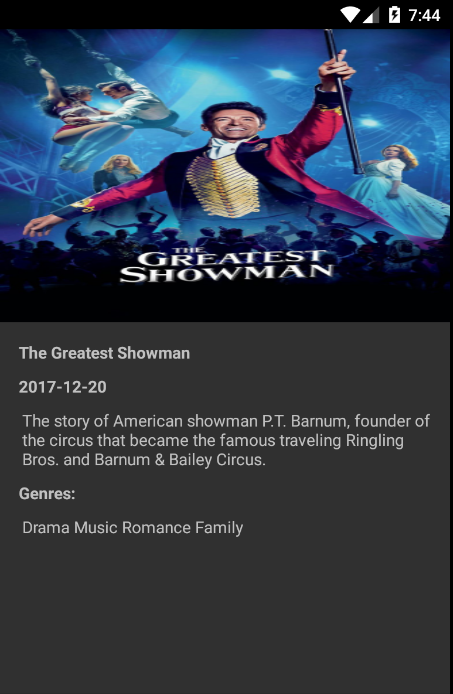
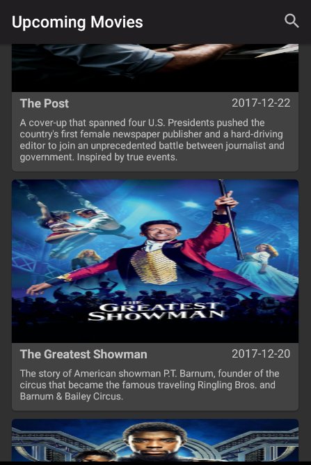

# Movie Database App

This is a simple android project that uses the [Movie Database API](https://www.themoviedb.org/)
to list and search upcoming movies.

## Screens




## Build

To build run ```./gradlew assembleRelease on the command line```
You must also the environment variable ```TMD_API_KEY``` containing
the API key for the service.

## Architecture and Frameworks

The app was built using the MVVM architecture which is a pattern that
originates from Microsoft. It's major advantages is that it removes
code from Activities/Fragments and the View is decoupled from the Model.

As for the libraries here's what I used and why:

* [Super RecyclerView](https://github.com/Malinskiy/SuperRecyclerView)

It improves upon the Android Framework's RecyclerView by adding features
such as infinite scrolling, empty view and etc. I've used it here primarily
due to the infinite scrolling feature.

* [Retrofit2](http://square.github.io/retrofit/)

A great REST API client which also integrates with RxJava. I'm using it for
it has a great API and docs/support.

* [Glide](https://github.com/bumptech/glide)

A Library for loading images. It's extremely simple to use and it is
very powerful. I've used it here to load the poster images.

* [Dagger2](https://google.github.io/dagger/)

A DI (Dependency Injection) library that uses annotation processing for compile time
generation of the graph of dependencies. Used here to better structure and manage
object creation.

* [RxJava](https://github.com/ReactiveX/RxJava)

A library for composing events and can be used for a plethora of things. Here I used
to handle some UI events and handle asynchronous code.
